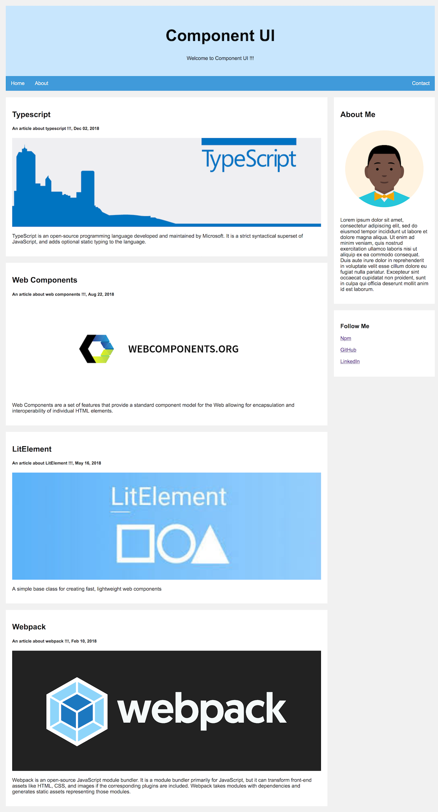

# Create-Component-UI
Scaffold lightweight UI boilerplate including typescript, webcomponents, lit-element and webpack.

# Usage
## With npx
```
$ npx create-component-ui
```
## Without npx

install create-component-ui globally
```
$ npm i -g create-component-ui
```
run `create-component-ui` inside the directory where you want to scaffold the project

```
$ create-component-ui
```

# Runing Boilerplate

1. `cd` into project boilerplate.
2. Run `npm run watch` to start the webpack. It will create dist directory with the bundled code and keep watching for changes.
3. Run `npm start` to start the dev server. It will automatically open the home page of boilerplate in the browser.
4. Run `npm run build` to create the optimized, minified and production ready code inside `dist` directory.

# Result


